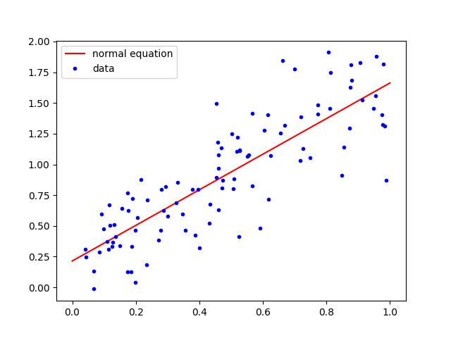

# Overview
This assignment asks you to implement a simple machine learning algorithm (linear regression using the normal equation) from scratch. You will use this algorithm to fit a line to provided data.

**This is an individual assignment. You are meant to write the code on your own. You are welcome to discuss *ideas* with other students (including on the class email list), but don't look at their code or show them yours.**

# Files
[`linear.py`](../src/linear.py)

# Data
Specific training data points are built into the file `linear.py` in the lists `xs` and `ys`. They were generated by taking points along a line and adding some noise (positive or negative) to the $y$ value. Using linear regression, your task is to find the numbers (intercept and slope) that define the original line.

# The Normal Equation
It happens that, for the case of linear regression, there is a closed-form formula for finding the best line. It is described [in equation 4 here](https://stats.libretexts.org/Bookshelves/Computing_and_Modeling/Supplemental_Modules_(Computing_and_Modeling)/Regression_Analysis/Simple_linear_regression/Simple_Linear_Regression_(with_one_predictor)).

Since these data only have a single value (rather than a vector) for $x$, this is simpler than the version on p. 134 of Géron.

Complete the function `regress_normal` to return these two values, which define the best line through the data.

The code at the bottom of the file will plot the line through the data. The result should look like this:

# Optional Challenge Problem
Also compute the slope and intercept using gradient descent.

# What to Hand in
Hand in your completed file `linear.py`. When run, it should produce the graph above.
