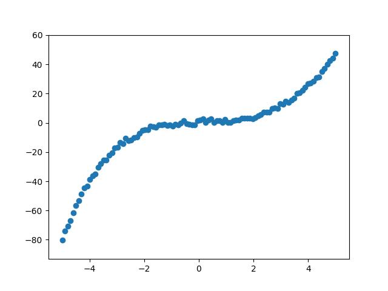
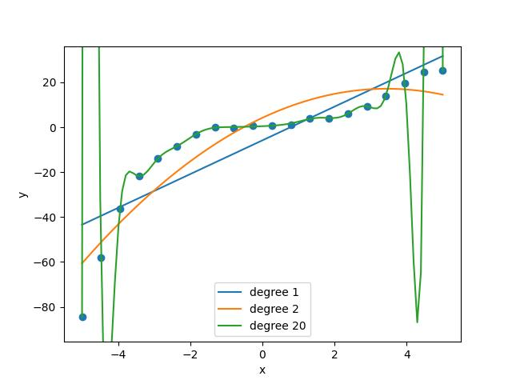
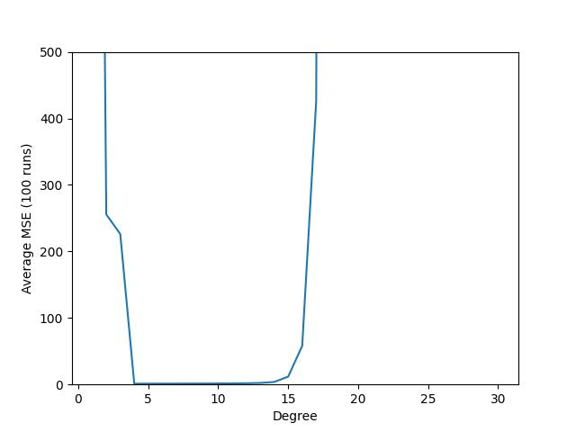

# Overview
This assignment introduces you to some of the Python packages we’re using (numpy, matplotlib, scikit-learn) and explores the interaction between dataset size and model complexity.

**This is a team assignment. When you are done, one member of your team should submit the file, including (as a comment at the top of the file) the names of everyone who contributed.**

# Files
[`test_polynomial.py`](../test/test_polynomial.py)  
[`polynomial.py`](../src/polynomial.py)

You will be completing some functions in `polynomial.py`.

# Generating Data

To keep things simple, the data in this assignment are randomly generated. Complete the functions `generate_coefficients` and `generate_data`. If you have done this correctly, the tests in `test_polynomial.py` will pass.

Now, if you uncomment the line `generate_and_plot_data(100)` near the bottom of the file, you should get a picture something like the one below. (The shape of the data will vary from one run to the next, because they are randomly generated.)

# Fitting Curves
Complete `fit_curve` and `plot_curve`.

Now, if you uncomment the line `experiment_1(20)` near the bottom of the file, you’ll get a picture something like this:

Run `experiment_1` with different parameters, like 10 or 30. Try to figure out why it behaves differently.

# Sensitivity Study

Now it's time to explore which degrees of polynomial models work best in which circumstances. Complete `mse`.

Now uncommenting `experiment_2(20)` should give you a picture like this:

Again, try it with different parameters and see how the result changes.

# Analysis

Finally, answer the following questions:
1. How, if at all, is overfitting/underfitting affected by the number of data points?
2. How, if at all, is overfitting/underfitting affected by the degree of the model polynomial?
3. Suppose you were asked to fit a polynomial to data that you knew were generated by another polynomial of unknown degree. How would you determine what degree of polynomial to use?

# On Working as a Team

Take some time to talk about what worked on the last team project, what didn't, and how you might improve things. Do you have good processes for communication and passing files around? Is everyone contributing roughly equally? What technologies are helping or getting in the way?

Figure out how to break this assignment into steps and decide who is working on which part.

Be careful not to fall back on stereotypes when deciding who is going to do, for example, "coding" and "writing" work. Over the course of the semester, everyone on the team should get to do every kind of work.

# Hints
The Python package you need to install is `scikit_learn`.

NumPy's `linspace` function is useful for generating the data.

Thanks to NumPy, `generate_data` can be written without any loops.

The Polynomial Regression section in chapter 4 of Géron has a lot of the code you're looking for.

# Optional Challenge Problem
Fit a decision tree, rather than a polynomial, to the same data.

# What to Hand In
One member of your team should hand in your completed version of `polynomial.py`. Be sure to fill in the names of everyone who contributed in the comment at the top.

The same person should also hand in, in a separate file, your answers to the analysis questions.
